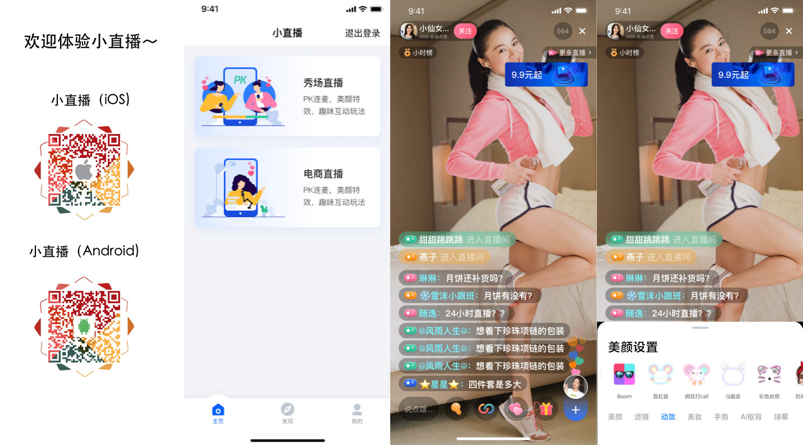

# 腾讯云移动直播终端组件 MLVB SDK
- [移动直播 SDK](https://cloud.tencent.com/product/mlvb)：基于腾讯云 LiteAV 音视频框架实现的一套推拉流和连麦组件，帮您快速上线手机直播功能。
- [云直播](https://cloud.tencent.com/product/lvb)：移动直播 SDK 所依赖的的云端服务，主要提供 RTMP 推流接入点、直播 CDN、实时转码等云端能力。

## 工程动态
尊敬的开发者，您好，感谢您基于小直播APP的支持和关注，随着直播市场的多样化和众多开发者的反馈，我们也积极响应大家的需求，，我们对小直播APP进行了一次新的调整，更加年轻的UI、更加科学的架构，欢迎大家体验我们新的[小直播APP](https://github.com/tencentyun/XiaoZhiBo)！

## SDK 下载
您可以在腾讯云官网下载页面 [DOWNLOAD](https://cloud.tencent.com/document/product/454/7873) 获取精简版、专业版和商用版的 SDK 下载链接，如下为精简版下载链接：

| 所属平台 | Zip下载 | Demo运行说明 | SDK集成指引 | API 列表 |
|:---------:| :--------:|:--------:| :--------:|:--------:|
| iOS | [下载](https://liteav.sdk.qcloud.com/download/latest/TXLiteAVSDK_Smart_iOS_latest.zip)| [DOC](https://github.com/tencentyun/MLVBSDK/blob/master/iOS/README.md)| [DOC](https://cloud.tencent.com/document/product/454/7876) | [API](https://cloud.tencent.com/document/product/454/34753) |
| Android | [下载](https://liteav.sdk.qcloud.com/download/latest/TXLiteAVSDK_Smart_Android_latest.zip)| [DOC](https://github.com/tencentyun/MLVBSDK/blob/master/Android/README.md)| [DOC](https://cloud.tencent.com/document/product/454/7877) | [API](https://cloud.tencent.com/document/product/454/34766) |
| 小程序 | [下载](https://liteavsdk-1252463788.cosgz.myqcloud.com/MLVB_WXMini_latest.zip)| [DOC](https://github.com/tencentyun/MLVBSDK/blob/master/WXMini/README.md)| [DOC](https://cloud.tencent.com/document/product/454/34925) | [API](https://cloud.tencent.com/document/product/454/15368) |

### 移动直播 SDK V1 升级到 V2 API 接口对比说明
移动直播 SDK 从 8.4 版本开始，提供了新的 V2 接口:
- 同时支持 RTMP 协议和 RTC 协议
- 支持更加强大灵活的连麦/PK 能力
  
对于使用 V1 的客户，我们提供了 V1 升级到 V2 的[接口升级指引对照表](https://docs.qq.com/sheet/DRkJUckpGdkNTUmt2)

### Version 9.4 @ 2021.12.08
- iOS：修复 V2TXLivePusher 推流前设置横屏预览，预览画面方向错误的问题；
- Android：修复 V2TXLivePlayer 偶现崩溃的问题；
- Android&iOS：优化快直播播放延迟；
- Android&iOS：V2TXLivePlayer 新增分辨率变更通知接口；
- Android&iOS：V2卡顿回调增加卡顿时长信息；

## MLVB Demo

<table style="text-align:center;vertical-align:middle;">
<tr>
<th>平台</th><th>Demo体验</th>
</tr>
<tr>
<td>iOS</td>
<td><a onclick="window.open('https://itunes.apple.com/cn/app/id1152295397?mt=8')">

</a></td>
</tr>
<tr>
<td>Android</td>
<td><a onclick="window.open('https://dldir1.qq.com/hudongzhibo/liteav/rtmpdemo.apk')">

</a></td>
</tr>
</tr>
</table>
 
**MLVB Demo 展示**
 

## 小直播 Demo

<table>
<tr>
<th>平台</th><th>Demo体验</th>
</tr>
<tr>
<td>iOS</td>
<td><a onclick="window.open('https://itunes.apple.com/cn/app/id1132521667?mt=8')">

</a></td>
</tr>
<tr>
<td>Android</td>
<td><a onclick="window.open('https://dldir1.qq.com/hudongzhibo/liteav/xiaozhibo.apk')">

</a></td>
</tr>
</tr>
</table>
 
**小直播 Demo 展示**
 

## 小程序 Demo

